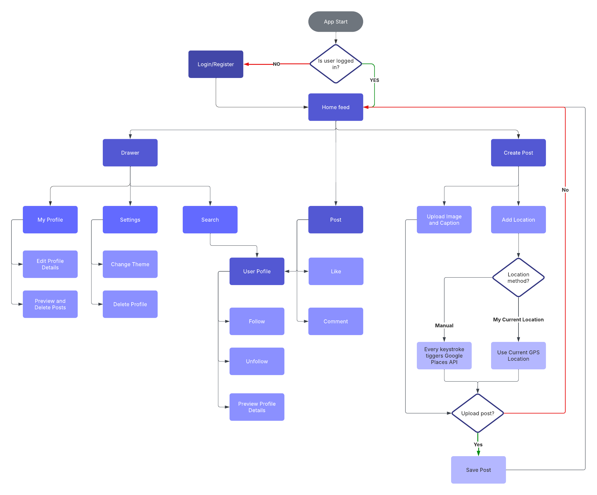

# Pinsta

Pinsta is a Flutter-based social media application backed by Firebase. It supports user authentication, post creation with mandatory image and caption, smart location tagging via GPS and Google Places API, likes, comments, a follow system, user search, and profile customization with light and dark theme support. State management is handled with the **BLoC pattern**.

---

## Features

| Feature | Description |
|--------|-------------|
| **Posts** | Share photos with captions and optional location tags |
| **Smart Location** | Auto-detect GPS location or search via Google Places API — only verified places can be tagged |
| **Likes & Comments** | Engage with posts through likes and comments |
| **Search** | Search for users across the platform |
| **User Profiles** | Customizable profiles with avatar and biography |
| **Follow System** | Follow and unfollow users |
| **Theme Support** | Light and dark mode |
| **Authentication** | Secure sign up, login, and session persistence |

---

## Architecture

Pinsta follows the **BLoC (Business Logic Component) pattern**, enforcing a clear separation between UI and business logic. Each feature has its own Cubit responsible for state management, and is organized into presentation, domain, and data layers.

---

## Tech Stack

**Mobile**
- Flutter — cross-platform framework (iOS & Android)
- Dart
- BLoC / Cubit — state management via `flutter_bloc`

**Backend & Cloud**
- Firebase Firestore — NoSQL cloud database
- Firebase Storage — image storage
- Firebase Authentication — user auth with session persistence

**External APIs**
- Google Places API — location search and reverse geocoding

---

## Data Flow

```
UI (Widget)
    │
    ▼
BLoC / Cubit  ◄──── Events / States
    │
    ▼
Repository
    │
    ├──► Firebase Firestore
    ├──► Firebase Storage
    ├──► Firebase Auth
    └──► Google Places API
```

---

## Location Flow

1. User opens the post creation screen
2. User selects a location method — GPS or manual search
3. If GPS: device coordinates are fetched and reverse-geocoded to a readable address
4. If manual: every keystroke fires a request to the Google Places API
5. Only suggestions returned by the API can be selected — no free-text input
6. The verified location is attached to the post and saved in Firestore

---

## Authentication

- Email/password registration and login via Firebase Auth
- Session persistence across app restarts
- Users can only edit or delete their own posts, comments, and profile data
- Reauthentication required for account deletion

---

## UI / UX

- Light and dark theme toggled from user preferences
- Consistent design language across all screens
- Drawer-based navigation with access to profile, settings, and account management

---

## Getting Started

### Prerequisites

- Flutter SDK `>=3.0.0`
- Firebase project with Authentication, Firestore, and Storage enabled
- Google Places API key

### Installation

```bash
git clone https://github.com/amit24af/uat-project.git
cd pinsta
flutter pub get
flutter run
```

### Firebase Setup

1. Create a Firebase project at console.firebase.google.com
2. Enable Authentication, Firestore, and Storage
3. Run `flutterfire configure` and select your target platforms

### Environment Variables

Create a `.env` file in the project root:

```
GOOGLE_PLACES_API_KEY=your_google_places_api_key
```

---

## App Flow

